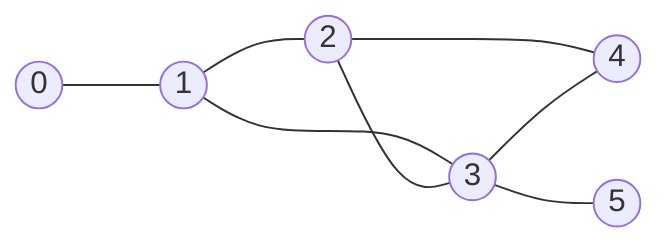
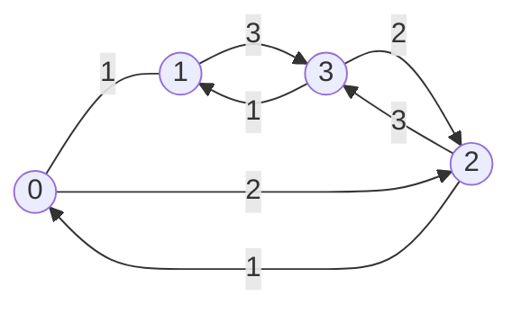

## Utilidades

### Incluir todas las bibliotecas

```cpp
#include <bits/stdc++.h>
```

### Redireccionar entrada y salida a archivos

Si la variable `ONLINE_JUDGE` no está definida, redirecciona la entrada y salida estandar a los archivos `input.txt` y `output.txt` respectivamente. Esto nos permite probar nuestro codigo con casos de prueba personalizados y ahorrarnos el tiempo de escribirlos en la entrada estandar cada vez que queramos probar nuestro codigo.

```cpp
#ifndef ONLINE_JUDGE
freopen("input.txt", "r", stdin);
freopen("output.txt", "w", stdout);
#endif
```

### Desincronizar stdio

La siguiente linea de codigo mejora el rendimiento de la entrada y salida estandar.

Solo se deben usar funciones de entrada y salida estandar de c++ (`cout` y `cin`).

```cpp
ios::sync_with_stdio(0);
```

## Macros

Las macros son fragmentos de codigo que se reemplazan en tiempo de precompilacion.

Nos sirve para automatizar tareas repetitivas, permitiendo asi el enfoque a la solucion del problema.

### For loop mas común

```cpp
#define FOR(nombre, inicio, fin) for (unsigned int nombre = inicio; nombre < fin; nombre++)
```

> [!NOTE]
> el valor de inicio debe ser menor que el valor de fin

Ejemplo:

```cpp
FOR(i, 0, 10) {
  std::cout << i << std::endl;
}
```

### Leer casos de prueba

Define una variable t y lee su valor desde la entrada estandar,luego hace un ciclo hasta que t llege a 0 (Falso)

```cpp
#define por_cada_caso \
  int t;              \
  std::cin >> t;      \
  while (t--)
```

Ejemplo:

```cpp
por_cada_caso {
  leer_variable(int, n);
  std::cout << n << std::endl;
}
```

### Leer variables hasta que termine la entrada

Recibe los mismos parametros que `scanf`, luego lee desde la entrada estandar hasta que llegue a `EOF` (End Of File).

Nota: `ios::sync_with_stdio(0)` no debe estar en el codigo.

```cpp
#define leer_variables_hasta_eof(patron, ...) while (scanf(patron,__VA_ARGS__) != EOF)
```

Ejemplo:

```cpp
int a, b;
leer_variables_hasta_eof("%d %d", &a, &b) {
  std::cout << a << " " << b << std::endl;
}
```

## Tecnicas

### Ordenar un vector/string en orden ascendente/lexicografico

```cpp
std::sort(v.begin(), v.end());
```

### Ordenar un vector en orden descendente

```cpp
std::sort(v.begin(), v.end(), std::greater<int>());
```

### Ordenar un vector/string de forma personalizada

La function `cmp` recibe dos parametros y retorna un valor booleano, si retorna `true` el primer parametro va antes que el segundo, si retorna `false` el segundo parametro va antes que el primero.

```cpp
bool cmp(int a, int b) {
  return a > b;
}

sort(v.begin(), v.end(), cmp);
```

### Permutar un vector/string

En cada iteracion del ciclo `do while` se permuta el vector/string a su siguiente permutacion, cuando ya no se puede permutar mas, `std::next_permutation` retorna `false` y el ciclo termina.

```cpp
do {
  // ...
} while (std::next_permutation(v.begin(), v.end()));
```

## Grafos

### Estructuras de datos y funciones de utilidad

#### Lista de adyacencia

Tipos de datos

```cpp
typedef size_t nodo;
typedef vector<vector<nodo>> adj_list;
```

#### Matriz de adyacencia

Tipos de datos

```cpp

```cpp
// Cambiar `valor_matriz` según el tipo de dato que se necesite
typedef size_t valor_matriz;
typedef pair<size_t, size_t> coordenada_matriz;
typedef vector<vector<valor_matriz>> matriz;
```

#### Vecinos en una Grilla ⚠️ Revisar

Parametros:

- `u`: coordenada de la matriz
- `diagonal`: si es `true` se incluyen los vecinos diagonales

Retorna:

- `vecinos`: vector de coordenadas de los vecinos

```cpp
typedef pair<int, int> vertice;
typedef int valor_grilla;

vector<vertice> vecinos_grid(
    vertice inicio, vector<vector<valor_grilla>> grid, size_t filas, size_t columnas, bool diagonal = false)
{
  auto [f0, c0] = inicio;
  vector<vertice> vecinos = {
      {f0 - 1, c0},
      {f0 + 1, c0},
      {f0, c0 - 1},
      {f0, c0 + 1},
  };
  if (diagonal)
  {
    vecinos.insert(vecinos.end(), {{f0 - 1, c0 - 1},
                                   {f0 + 1, c0 + 1},
                                   {f0 - 1, c0 + 1},
                                   {f0 + 1, c0 - 1}});
  }
  vecinos.erase(remove_if(
      vecinos.begin(), vecinos.end(),
      [&](vertice a)
      { auto [f, c] = a; return !(f >= 0 && f < filas && c >= 0 && c < columnas); }));
  return vecinos;
}
```

### Algoritmos

#### Encontrar cantidad de componentes conexas en un Grafo

```cpp
int countConnectedComponents() {
        vector<bool> visited(V, false); 
        int components = 0;
        for (int i = 0; i < V; ++i) {
            if (!visited[i]) {
                DFS(i, visited);
                components++;
            }
        }
        return components; 
    }
```

#### Busqueda en Amplitud en Lista de adyacencia(BFS)

El algoritmo de busqueda en amplitud es un algoritmo que permite recorrer o buscar elementos en un grafo.

La busqueda se realiza por niveles, es decir, primero se visitan todos los nodos adyacentes al nodo inicial, luego los nodos adyacentes de los nodos adyacentes y asi sucesivamente.

```cpp
#include <bits/stdc++.h>

using namespace std;

typedef int nodo;
typedef vector<vector<nodo>> adj_list;

vector<nodo> bfs(nodo inicio, adj_list grafo, size_t N)
{
  queue<nodo> cola;
  vector<bool> visitado(N, false);
  vector<nodo> predecesor(N, -1);

  visitado[inicio] = true;
  cola.push(inicio);

  while (!cola.empty())
  {
    nodo actual = cola.front();
    cola.pop();

    for (auto vecino : grafo[actual])
    {
      if (!visitado[vecino])
      {
        visitado[vecino] = true;
        predecesor[vecino] = actual;
        cola.push(vecino);
      }
    }
  }

  return predecesor;
}
```

Ejemplo:
  


```cpp
  adj_list graph = {
    {1}, // 0 -> [1]
    {0, 2, 3}, // 1 -> [0, 2, 3]
    {1, 3, 4}, // 2 -> [1, 3, 4]
    {1, 2, 4, 5}, // 3 -> [1, 2, 4, 5]
    {2, 3}, // 4 -> [2, 3]
    {3}, // 5 -> [3]
  };

  vector<nodo> predecesor = bfs(0, graph, graph.size());

  // ruta de 0 a 5
  nodo actual = 5;

  while (actual != -1)
  {
    cout << actual << " <- ";
    actual = predecesor[actual];
  }
```

---

#### Busqueda en Profundidad en Lista de adyacencia (DFS)

Version imperativa

```cpp
#include <bits/stdc++.h>

using namespace std;

typedef int nodo;
typedef vector<vector<nodo>> adj_list;

vector<nodo> dfs(nodo inicio, adj_list grafo, size_t N)
{
  stack<nodo> pila;
  vector<bool> visitado(N, false);
  vector<nodo> predecesor(N, -1);

  visitado[inicio] = true;
  pila.push(inicio);

  while (!pila.empty())
  {
    nodo u = pila.top();
    pila.pop();

    for (nodo v : grafo[u])
    {
      if (!visitado[v])
      {
        visitado[v] = true;
        pila.push(v);
        predecesor[v] = u;
      }
    }
  }
  return predecesor;
}
```

Version recursiva

```cpp
#include <bits/stdc++.h>

using namespace std;

typedef int nodo;
typedef vector<vector<nodo>> adj_list;
vector<nodo> dfs_recursive(nodo inicio, adj_list grafo, size_t N)
{

  vector<bool> visitado(N, false);
  vector<nodo> predecesor(N, -1);

  function<void(nodo)> iterar_nodo = [&](nodo u)
  {
    visitado[u] = true;
    for (nodo v : grafo[u])
    {
      if (!visitado[v])
      {
        predecesor[v] = u;
        iterar_nodo(v);
      }
    }
  };

  iterar_nodo(inicio);
  return predecesor;
}
```

Ejemplo:
  


```cpp
  adj_list graph = {
    {1}, // 0 -> [1]
    {0, 2, 3}, // 1 -> [0, 2, 3]
    {1, 3, 4}, // 2 -> [1, 3, 4]
    {1, 2, 4, 5}, // 3 -> [1, 2, 4, 5]
    {2, 3}, // 4 -> [2, 3]
    {3}, // 5 -> [3]
  };

  vector<nodo> predecesor = dfs(0, graph, graph.size());

  // ruta de 0 a 5
  nodo actual = 5;

  while (actual != -1)
  {
    cout << actual << " <- ";
    actual = predecesor[actual];
  }
```

---

#### Busqueda en Profundidad en Matriz de adyacencia (DFS)

Parametros:

- `inicio`: coordenada inicial
- `matriz`: matriz
- `visitado`: matriz de visitados
- `fn_top`: funcion que se ejecuta al visitar un nodo
- `fn_vecino`: funcion que agrega restricciones a los vecinos

```cpp
void dfs_matriz(
    coordenada_matriz inicio,
    vector<vector<valor_matriz>> &matriz,
    vector<vector<bool>> &visitado,
    function<void(coordenada_matriz)> fn_top = [](coordenada_matriz) {},
    function<bool(coordenada_matriz)> fn_vecino = [](coordenada_matriz)
    { return true; })
{
  stack<coordenada_matriz> pila;

  auto [i0, j0] = inicio;
  visitado[i0][j0] = true;
  pila.push(inicio);

  while (!pila.empty())
  {
    auto u = pila.top();
    pila.pop();
    fn_top(u);
    for (coordenada_matriz v : vecinos_matriz(u))
    {
      auto [vi, vj] = v;
      if (valid_value(vi, vj, matriz) && fn_vecino(v) && !visitado[vi][vj])
      {
        pila.push(v);
        visitado[vi][vj] = true;
      }
    }
  }
}
```

#### Dijkstra

El algoritmo de Dijkstra permite encontrar la ruta mas corta entre un nodo inicial y todos los demas nodos de un grafo con pesos no negativos.

Parametros:

- `start`: nodo inicial
- `graph`: lista de adyacencia
- `N`: numero de nodos

Retorna:

- `dist`: vector de distancias
- `predecesor`: vector de predecesores

```cpp
#include <bits/stdc++.h>
using namespace std;


typedef int nodo;
typedef unsigned int peso;
typedef vector<peso> distancias;
typedef pair<peso, nodo> adj_el;
typedef vector<vector<adj_el>> adj_list;
typedef priority_queue<adj_el, vector<adj_el>, greater<adj_el>> pq;

const peso INF = std::numeric_limits<peso>::max();

pair<distancias, vector<nodo>> dijkstra(nodo inicio, adj_list grafo, size_t N)
{
  pq cola;
  vector<bool> visitado(N, false);
  distancias dist(N, INF);
  vector<nodo> predecesor(N, -1);

  visitado[inicio] = true;
  dist[inicio] = 0;
  cola.push(adj_el(0, inicio));

  while (!cola.empty())
  {
    adj_el el = cola.top();
    nodo u = el.second;
    peso uw = el.first;
    cola.pop();

    if (uw != dist[u])
      continue;

    for (adj_el vecino : grafo[u])
    {
      nodo v = vecino.second;
      peso vw = vecino.first;
      if (dist[u] + vw < dist[v])
      {
        dist[v] = dist[u] + vw;
        cola.push({dist[v], v});
        predecesor[v] = u;
      }
    }
  }
  return {dist, predecesor};
}
```

Ejemplo:


  
```cpp
// nodo -> [...(peso, nodo)]
adj_list graph = {
  {adj_el(1, 1), adj_el(2, 2)}, // 0 -> [ (w:1, v:1), (w:2, v:2) ]
  {adj_el(1, 0), adj_el(3, 3)}, // 1 -> [ (w:1, v:0), (w:3, v:3) ]
  {adj_el(1, 0), adj_el(3, 3)}, // 2 -> [ (w:1, v:0), (w:3, v:3) ]
  {adj_el(1, 1), adj_el(2, 2)}, // 3 -> [ (w:1, v:1), (w:2, v:2) ]
};

pair<distancias, vector<nodo>> res = dijkstra(0, graph, graph.size());

distancias dist = res.first;
vector<nodo> predecesor = res.second;

// distancia de 0 a 3
cout << dist[3] << endl;

// ruta de 0 a 3
nodo u = 3;
while (u != -1)
{
  cout << u << " ";
  u = predecesor[u];
}

```

#### Prim (Arbol recubridor minimo)

El algoritmo de Prim permite encontrar el arbol recubridor minimo de un grafo.

Parametros:

- `graph`: lista de adyacencia
- `vertices`: numero de vertices
Retorna:
- `min_cost`: costo minimo del arbol recubridor

```cpp
typedef int nodo;
typedef size_t peso;
typedef pair<peso, nodo> adj_el;
typedef vector<vector<adj_el>> adj_list;
typedef priority_queue<adj_el, vector<adj_el>, greater<adj_el>> pq;

peso prim(adj_list &graph, size_t vertices)
{
  peso min_cost = 0;
  vector<bool> visited(vertices, false);
  pq pqueue;
  pqueue.push({0, 0});

  while (!pqueue.empty())
  {
    auto [u_w, u] = pqueue.top();
    pqueue.pop();
    if (visited[u])
    {
      continue;
    }
    visited[u] = true;
    min_cost += u_w;

    for (auto [v_w, v] : graph[u])
    {
      if (!visited[v])
      {
        pqueue.push({v_w, v});
      }
    }
  }
  return min_cost;
}
```
