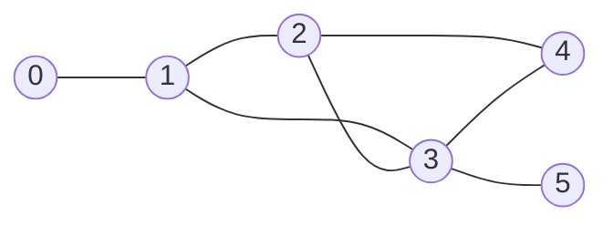
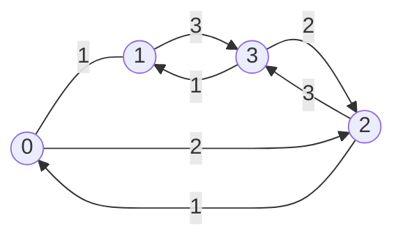

# Programacion Competitiva

Este repositorio contiene algoritmos y utilidades para programación competitiva

## Indice

- [Utilidades](#utilidades)
  - [Incluir todas las bibliotecas](#incluir-todas-las-bibliotecas)
  - [Redireccionar entrada y salida a archivos](#redireccionar-entrada-y-salida-a-archivos)
  - [Leer una linea](#leer-una-linea)

- [Macros](#macros)
  - [For loop mas común](#for-loop-mas-común)
  - [Leer una variable](#leer-una-variable)
  - [Leer un arreglo](#leer-un-arreglo)
  - [Leer casos de prueba](#leer-casos-de-prueba)
  - [Leer variables hasta que termine la entrada](#leer-variables-hasta-que-termine-la-entrada)

- [Tecnicas](#tecnicas)
  - [Ordenar un vector/string en orden ascendente/lexicografico](#ordenar-un-vectorstring-en-orden-ascendentelexicografico)
  - [Ordenar un vector en orden descendente](#ordenar-un-vector-en-orden-descendente)
  - [Ordenar un vector/string de forma personalizada](#ordenar-un-vectorstring-de-forma-personalizada)
  - [Permutar un vector/string](#permutar-un-vectorstring)

- [Algoritmos](#algoritmos)
  - [Grafos](#grafos)
    - [Busqueda en Amplitud (BFS)](#busqueda-en-amplitud-bfs)
    - [Busqueda en Profundidad (DFS)](#busqueda-en-profundidad-dfs)
    - [Dijkstra](#dijkstra)
    - [Prim](#prim)

## Utilidades

### Incluir todas las bibliotecas

```cpp
#include <bits/stdc++.h>
```

### Redireccionar entrada y salida a archivos

Si la variable `ONLINE_JUDGE` no está definida, redirecciona la entrada y salida estandar a los archivos `input.txt` y `output.txt` respectivamente. Esto nos permite probar nuestro codigo con casos de prueba personalizados y ahorrarnos el tiempo de escribirlos en la entrada estandar cada vez que queramos probar nuestro codigo.

```cpp
#ifndef ONLINE_JUDGE
freopen("input.txt", "r", stdin);
freopen("output.txt", "w", stdout);
#endif
```

### Leer una linea

```cpp
std::string line;
std::getline(std::cin, line);
```

## Macros

Las macros son fragmentos de codigo que se reemplazan en tiempo de precompilacion.

Nos sirve para automatizar tareas repetitivas, permitiendo asi el enfoque a la solucion del problema.

### For loop mas común

```cpp
#define FOR(nombre, inicio, fin) for (unsigned int nombre = inicio; nombre < fin; nombre++)
```

> [!NOTE]
> el valor de inicio debe ser menor que el valor de fin

Ejemplo:

```cpp
FOR(i, 0, 10) {
  std::cout << i << std::endl;
}
```

### Leer una variable

Define una variable y lee su valor desde la entrada estandar

```cpp
#define leer_variable(tipo, nombre) \
  tipo nombre;                      \
  std::cin >> nombre
```

Ejemplo:

```cpp
leer_variable(int, n);
std::cout << n << std::endl;
```

### Leer un arreglo

Define un arreglo de tamaño n y lee sus valores desde la entrada estandar

```cpp
#define leer_arreglo(tipo, nombre, n) \
  tipo nombre[n];                     \
  FOR(i, 0, n)                        \
  std::cin >> nombre[i]
```

Ejemplo:
  
```cpp
leer_arreglo(int, a, 5);
FOR(i, 0, 5) {
  std::cout << a[i] << std::endl;
}
```

### Leer casos de prueba

Define una variable t y lee su valor desde la entrada estandar,luego hace un ciclo hasta que t llege a 0 (Falso)

```cpp
#define por_cada_caso \
  int t;              \
  std::cin >> t;      \
  while (t--)
```

Ejemplo:

```cpp
por_cada_caso {
  leer_variable(int, n);
  std::cout << n << std::endl;
}
```

### Leer variables hasta que termine la entrada

Recibe los mismos parametros que `scanf`, luego lee desde la entrada estandar hasta que llegue a `EOF` (End Of File)

```cpp
#define leer_variables_hasta_eof(patron, ...) while (scanf(patron,__VA_ARGS__) != EOF)
```

Ejemplo:

```cpp
int a, b;
leer_variables_hasta_eof("%d %d", &a, &b) {
  std::cout << a << " " << b << std::endl;
}
```

## Tecnicas

### Ordenar un vector/string en orden ascendente/lexicografico

```cpp
std::sort(v.begin(), v.end());
```

### Ordenar un vector en orden descendente

```cpp
std::sort(v.begin(), v.end(), std::greater<int>());
```

### Ordenar un vector/string de forma personalizada

La function `cmp` recibe dos parametros y retorna un valor booleano, si retorna `true` el primer parametro va antes que el segundo, si retorna `false` el segundo parametro va antes que el primero.

```cpp
bool cmp(int a, int b) {
  return a > b;
}

sort(v.begin(), v.end(), cmp);
```

### Permutar un vector/string

En cada iteracion del ciclo `do while` se permuta el vector/string a su siguiente permutacion, cuando ya no se puede permutar mas, `std::next_permutation` retorna `false` y el ciclo termina.

```cpp
do {
  // ...
} while (std::next_permutation(v.begin(), v.end()));
```

## Algoritmos

### Grafos

#### Busqueda en Amplitud (BFS)

El algoritmo de busqueda en amplitud es un algoritmo que permite recorrer o buscar elementos en un grafo.

La busqueda se realiza por niveles, es decir, primero se visitan todos los nodos adyacentes al nodo inicial, luego los nodos adyacentes de los nodos adyacentes y asi sucesivamente.

```cpp
#include <bits/stdc++.h>

using namespace std;

typedef int nodo;
typedef vector<vector<nodo>> adj_list;

vector<nodo> bfs(nodo inicio, adj_list grafo, size_t N)
{
  queue<nodo> cola;
  vector<bool> visitado(N, false);
  vector<nodo> predecesor(N, -1);

  visitado[inicio] = true;
  cola.push(inicio);

  while (!cola.empty())
  {
    nodo actual = cola.front();
    cola.pop();

    for (auto vecino : grafo[actual])
    {
      if (!visitado[vecino])
      {
        visitado[vecino] = true;
        predecesor[vecino] = actual;
        cola.push(vecino);
      }
    }
  }

  return predecesor;
}
```

Ejemplo:
  


```cpp
  adj_list graph = {
    {1}, // 0 -> [1]
    {0, 2, 3}, // 1 -> [0, 2, 3]
    {1, 3, 4}, // 2 -> [1, 3, 4]
    {1, 2, 4, 5}, // 3 -> [1, 2, 4, 5]
    {2, 3, 5}, // 4 -> [2, 3, 5]
    {3, 4}, // 5 -> [3, 4]
  };

  vector<nodo> predecesor = bfs(0, graph, graph.size());

  // ruta de 0 a 5
  nodo actual = 5;

  while (actual != -1)
  {
    cout << actual << " <- ";
    actual = predecesor[actual];
  }
```

#### Busqueda en Profundidad (DFS)

⚠️ Revisar

```cpp
```

#### Dijkstra

El algoritmo de Dijkstra permite encontrar la ruta mas corta entre un nodo inicial y todos los demas nodos de un grafo con pesos no negativos.

Parametros:

- `start`: nodo inicial
- `graph`: lista de adyacencia
- `N`: numero de nodos

Retorna:

- `dist`: vector de distancias
- `predecesor`: vector de predecesores

```cpp
#include <bits/stdc++.h>
using namespace std;


typedef int nodo;
typedef unsigned int peso;
typedef vector<peso> distancias;
typedef pair<peso, nodo> adj_el;
typedef vector<vector<adj_el>> adj_list;
typedef priority_queue<adj_el, vector<adj_el>, greater<adj_el>> pq;

const peso INF = std::numeric_limits<peso>::max();

pair<distancias, vector<nodo>> dijkstra(nodo inicio, adj_list grafo, size_t N)
{
  pq cola;
  vector<bool> visitado(N, false);
  distancias dist(N, INF);
  vector<nodo> predecesor(N, -1);

  visitado[inicio] = true;
  dist[inicio] = 0;
  cola.push(adj_el(0, inicio));

  while (!cola.empty())
  {
    adj_el el = cola.top();
    nodo u = el.second;
    peso uw = el.first;
    cola.pop();

    if (uw != dist[u])
      continue;

    for (adj_el vecino : grafo[u])
    {
      nodo v = vecino.second;
      peso vw = vecino.first;
      if (dist[u] + vw < dist[v])
      {
        dist[v] = dist[u] + vw;
        cola.push(adj_el(dist[v], v));
        predecesor[v] = u;
      }
    }
  }
  return make_pair(dist, predecesor);
}
```

Ejemplo:


  
```cpp
// nodo -> [...(peso, nodo)]
adj_list graph = {
  {adj_el(1, 1), adj_el(2, 2)}, // 0 -> [ (w:1, v:1), (w:2, v:2) ]
  {adj_el(1, 0), adj_el(3, 3)}, // 1 -> [ (w:1, v:0), (w:3, v:3) ]
  {adj_el(1, 0), adj_el(3, 3)}, // 2 -> [ (w:1, v:0), (w:3, v:3) ]
  {adj_el(1, 1), adj_el(2, 2)}, // 3 -> [ (w:1, v:1), (w:2, v:2) ]
};

pair<distancias, vector<nodo>> res = dijkstra(0, graph, graph.size());

distancias dist = res.first;
vector<nodo> predecesor = res.second;

// distancia de 0 a 3
cout << dist[3] << endl;

// ruta de 0 a 3
nodo u = 3;
while (u != -1)
{
  cout << u << " ";
  u = predecesor[u];
}

```

#### Prim

⚠️ Revisar

```cpp
```
